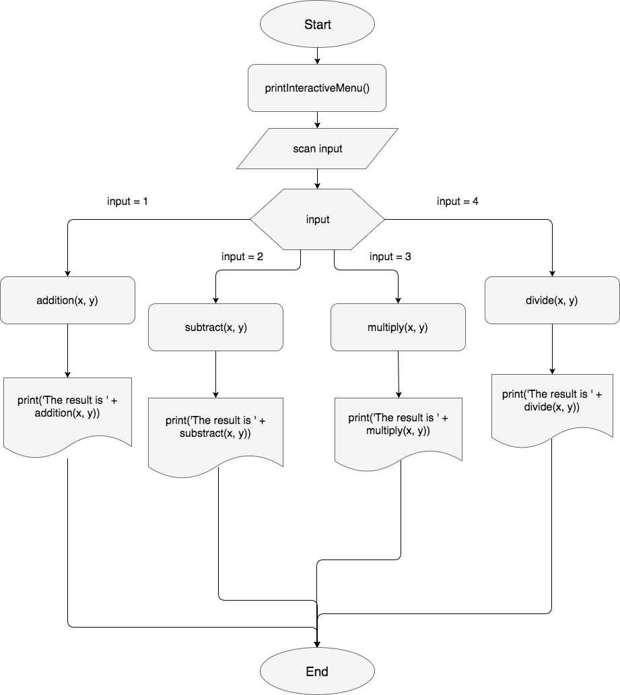

# goCalculator

This is a basic calculator programmed in a 3 hour long mob programming session during the [PLIBMTTBHGATY](http://plibmttbhgaty.com/) event at [Makers Academy](http://www.makersacademy.com/) in order to explore the [Golang](https://golang.org/).

## Quickstart

To run this program in your computer first you need to clone the repo and enter the applications folder

```bash
git clone git@github.com:georn/goCalculator-learning-go.git
cd goCalculator-learning-go
```

Next you need to install go in your computer, to do so you can always refer to the [official Goland documentation](https://golang.org/doc/install):

After installing you should be able to first build the program with the following command:

```bash
go build src/calculator.go
```

Which will create an executable named `calculator`, to run the program just type:

```bash
./calculator
```

## Process

Very much like C, a Go program has a `func main() {}` where the code runs imperatively. That made us realize that we could easily structure the code in a Control Flow diagram.



We proceeded to make our way through the code programming in a similar way to a C program. We declare 4 functions to handle the calculations and also handle standard input and output. 

The **big exception** in this project is that we didn't proceed to do testing. This was more of an explotarial project just for fun and for an meetup rather than a full depth into Golang.


## Collaborators

Programmers in the mob programming session:

- [Simon Ashbery](https://github.com/SiAshbery)
- [Mysterious Programmer who I was not polite enough to ask his github account]
